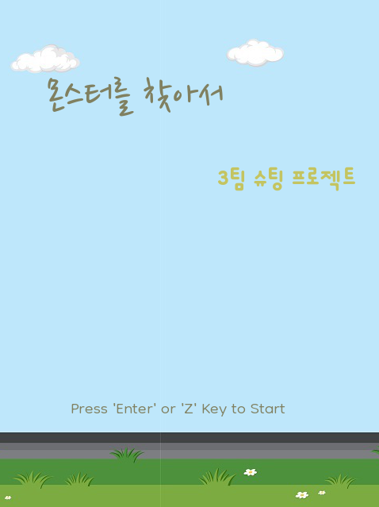
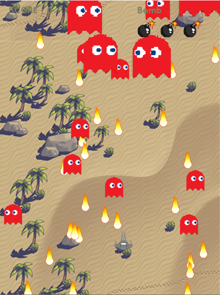
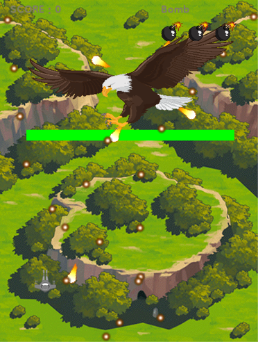

# AI Class 

### [1. Python](#Python)
  - [몬스터를 찾아서](#몬스터를-찾아서)

### [※ 학습 커리큘럼](#학습-커리큘럼)

## Python

### 몬스터를 찾아서

  
  
  

- 팀프로젝트 [4인]
- Python [pygame]
- 종 스크롤 비행 슈팅 게임
- 기간 : 3주[9/21 - 10/10]
- 특이점 : 모듈화, 라이브러리화 [Background, Pool, Text]

## Web 강의

## JAVA 프로그래밍

## 학습 커리큘럼

- [2023.09.13 - 2023.09.22] Python 기본 문법 학습
- [2023.09.25 - 2023.10.13] [Front]Web Programming
- [2023.10.16 - 진행중] Java Programming

## 포트폴리오 일정
- [2023.09.21 - 2023.10.10] [팀프로젝트]Python 슈팅 게임 구현
- [2023.10.25 - ] [싱글프로젝트] JAVA 네트워크 끝말잇기 게임
